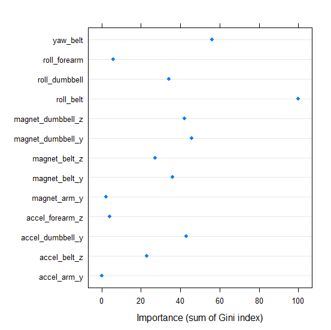
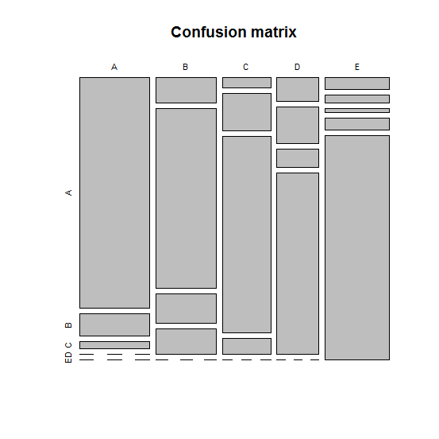

# Class project for Practical Machine Learning, Dec' 2014
# Final version: Sun 23.11.2014

Introduction
---------------------------------------
Using activity bands such as Fitbit or the Nike Fuelband (or hundreds of other devices),
it is now possible to measure in detail one's own activity, a cornerstone of the
so-called Quantified Selves movement, which seeks to understand (and improve)
lives through quantitative monitoring [1]. However, quantification is not only
about the number of measurements taken, but also the quality of the
measurement, and its validity (i.e. what -- if anything -- it corresponds to
in real life). The text below reports at a look at quantification of how well,
as opposed to simply how much, a series of exercises were carried out, and
attempts to fit a machine learning algorithm to predict the results based on
such measurements.

Methods
---------------------------------------

Data collection
----------------
Data, in the form of a training set and a test set stored in two csv files, were
downloaded from Coursera on Monday 17.11.2014. The dataset originates from the
weight lifting data set from the Human Activity Recognition website (http://groupware.les.inf.puc-rio.br/har).
The training data consist of 19622 observations for six participants, with measurements
attempting to quantify how a series of exercises were performed as the participants
were asked to perform them either correctly or incorrectly.

Exploration and processing
----------------
An initial exploration of the data was carried out using descriptive summaries.
For each of the six test subjects, the data contain measurements from accelerometers
attached to the belt and arms, as well as dumbbells used by the participants.
Exploration, processing (and subsequent analysis) was carried out with the statistical
software package R [2].

As a first step, a number of non-numerical columns were removed, for example
'user_name'. Variables containing time stamp variables were also removed,
since the exact time of the exercise is not likely to influence the manner
in which it is conducted.

The training dataset contained a large number missing values. Missing values
are a problem for most machine learning algorithms unless specific steps are taken
to circumvent the problem such as imputation [3]. However, in this case the
number of missing cases for each column was so high (over 90%) that an
imputation would not add much meaningful information. Instead, the columns
in question were removed using the `na.omit()` function in R. This step reduced
the dataset to 292 observations and 130 variables.


Training and machine learning
----------------
In order to train a model that was capable of predicting the activity level (a
qualitative variable with five levels: A, B, C, D, and E), it is important to
avoid overfitting, i.e. adapting the trained model too closely to noise in
the test set. To get an idea of the out of sample error rate, a 3-fold cross
validation was carried out by splitting the data (loaded into R as `weight`)
into three random subparts, illustrated with the code below.

```

set.seed(1234)

set.seed(1234)
x0 = 1:nrow(weight)
inTrain1 = sample(x=x0, size=97, replace=F)
x1 = x0[-inTrain1]
inTrain2 = sample(x=x1, size=97, replace=F)
inTrain3 = x0[-c(inTrain1, inTrain2)]

training1 = weight[inTrain1,]
training2 = weight[inTrain2,]
training3 = weight[inTrain3,]

```
This resulted in three parts, training1, training2, and training3 (with
respectively 97, 97, and 98 observations). Using the R package caret [4]
three models were fit:

```
library(caret)

tmod1 = train(classe ~ ., method="rf", data=rbind(training1, training2))
tmod2 = train(classe ~ ., method="rf", data=rbind(training2, training3))
tmod3 = train(classe ~ ., method="rf", data=rbind(training1, training3))

```
The models (indicated by `method="rf"`) were `randomForest` models, a
machine learning algorithm which is suitable for a qualitative response,
reasonably accurate, and also fairly robust against overfitting [5].
The average in-sample accuracy was only 76.38%, i.e. not very good (with an
error rate of 23.62%). By inspecting the variable importance
(using the `varImp()` function) of the 20 most important predictors in
each of the three models, a set of 35 predictors showed potential for
good predictive capability. However, since 22 of those were coded as missing
in the final test set, the list was further reduced to the
13 remaining predictors (see appendix for list).

Re-training the models with these predictors improved the in-sample accuracy
to an average of 82.37% (i.e. an error rate of 17.63%). Since this estimate might be too optimistic, the
out-of-sample error rate was estimated by predicting the results over the
k-folds (i.e. the third of the data held out for each of the three models).
This was done with the `predict()` function:

```
myres1 = predict(tmod1b, newdata=training3)
myres2 = predict(tmod2b, newdata=training1)
myres3 = predict(tmod3b, newdata=training2)

```
Using the `confusionMatrix()` function, the predicted and observed results were
compared for each of the three models. The average accuracy for the three
models was 73%, which serves as the estimated out of sample error rate, suggesting
that the in-sample estimate of 82.37% was somewhat optimistic.

The plot below shows the importance of each predictor (based on the Gini
coefficient) in the final result. Despite much variation, it seems that
belt and dumbbell measurements work best.



The mosaic plot below, showing the final model's confusion matrix,
shows that classes A and E were the easiest for the model to predict,
with B and D being the hardest.



The final model was fitted to the entire training set with the following
command (again using the caret package):

```
finalMod = train(classe ~ magnet_dumbbell_z + magnet_dumbbell_y + accel_forearm_z +
magnet_arm_y + accel_dumbbell_y + roll_dumbbell + accel_arm_y + roll_forearm +
roll_belt+  magnet_belt_y+  yaw_belt+  magnet_belt_z + accel_belt_z,
method="rf", data=weight3)

```
The predicted outcome for the final test set was created with the following command:

```
predRes = predict(finalMod, newdata=test)
```


Results
---------------------------------------
The final model, fitted on the entire training set, achieved an in-sample
accuracy of 79.11%. The final predictions on the test set were as follows:

Pred. class   | Num. pred. cases
--------|--------
  A     |    7
  B     |    7
  C     |    1
  D     |    2
  E     |    3


Although the machine predictions doubtlessly can be improved, through
more data, better quality measurements, and improved machine learning
algorithms, the experiment reported on here highlights a pertinent point
brought up by Walker [1]: if we are adjusting our behavior, in this case
exercise and fitness regimes, so that they can be read and monitored by
machines, are we then really exercising for the machines or for our
own health and enjoyment?


References
---------------------------------------
 [1] J. Walker, Seeing Ourselves Through Technology. Palgrave Macmillan, 2014 (Open access).
 
 [2] R Development Core Team, R: A Language and Environment for Statistical Computing. Vienna, 2014.
 
 [3] M. Kuhn, “Building predictive models in R using the caret package,” Journal of Statistical Software, vol. 28, no. 5, pp. 1–26, 2008.
 
 [4] Max Kuhn. Contributions from Jed Wing, Steve Weston, Andre Williams, Chris Keefer, Allan Engelhardt, Tony Cooper, Zachary
   Mayer, Brenton Kenkel, the R Core Team and Michael Benesty.  caret: Classification and Regression Training. R package
   version 6.0-37. 2014
   
 [5] A. Liaw and M. Wiener, “Classification and Regression by randomForest,” R News, vol. 2, no. 3, pp. 18–22, 2002.
 
 
Appendix
---------------------------------------
* magnet_dumbbell_z
* magnet_dumbbell_y
* accel_forearm_z
* magnet_arm_y
* accel_dumbbell_y
* roll_dumbbell
* accel_arm_y
* roll_forearm
* roll_belt
* magnet_belt_y
* yaw_belt
* magnet_belt_z
* accel_belt_z


